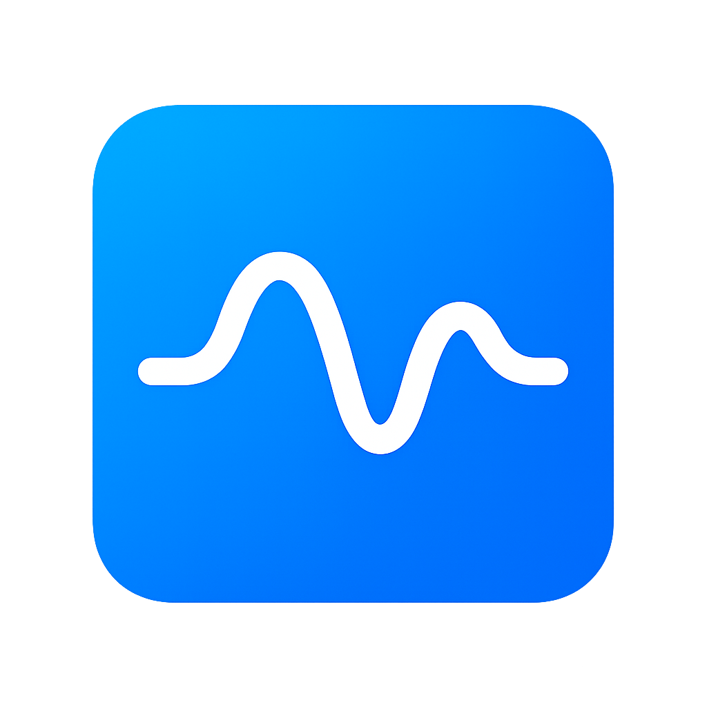

<p align="center">
  
</p>

<h1 align="center">StatePulse</h1>

<p align="center">
A lightweight, reactive, hydrated state-management library for Flutter — inspired by <b>Provider</b> + <b>Hydrated Bloc</b>, but <i>10× simpler</i>.
</p>

<p align="center">
  
  
  
  
  
</p>

---

## 🚀 Features

- 🌊 **Simple API** — only a few core classes
- 🔥 **Ultra-fast UI updates** (InheritedNotifier + AnimatedBuilder)
- 💾 **Built-in hydration** using `HydratedStatePulse`
- 🎯 **Selectors**, **Listeners**, and **Consumers** (like Bloc/Provider)
- 🧩 Supports **local store instances** (per-widget state)
- ⚡ **Zero boilerplate**
- 🟦 **Zero dependencies** (only `shared_preferences` for persistence)
- 🧠 Designed for **small → large production apps**

---

## 📦 Install

```yaml
dependencies:
  state_pulse: ^0.0.5
```

🧩 Quick Start Example

1. Create a Store
   class CounterStore extends ChangeNotifier with HydratedStatePulse {
   int value = 0;

void increment() {
value++;
notifyListeners();
}

@override
String get storageKey => 'counter_store';

@override
Map<String, dynamic> toJson() => {'value': value};

@override
void fromJson(Map<String, dynamic> json) {
value = json['value'] ?? 0;
}
}

2. Provide the Store
   StatePulseProvider(
   store: CounterStore(),
   child: MyApp(),
   );

3. Use With Builder
   StatePulseBuilder<CounterStore>(
   builder: (\_, store) => Text('${store.value}'),
   );

🎯 Selector Example (High Performance Rebuilds)

Only rebuilds when the selected value changes.

StatePulseSelector<CounterStore, int>(
selector: (store) => store.value,
builder: (\_, value) => Text('$value'),
);

👂 Listener Example (Side-effects — No UI Rebuild)
StatePulseListener<CounterStore>(
listener: (\_, store) {
if (store.value == 10) {
print("Reached 10!");
}
},
child: SomeWidget(),
);

🔀 Consumer Example (Listener + Builder)
StatePulseConsumer<CounterStore>(
listener: (_, store) => print("Changed!"),
builder: (_, store) => Text("${store.value}"),
);

🧪 Local Store Instance (Widget-Scoped State)

Each widget has its own isolated store:

final localStore = CounterStore();

StatePulseBuilder<CounterStore>(
store: localStore,
builder: (\_, store) => Text("${store.value}"),
);

🔧 Advanced Example — Hydrated User Store
class UserStore extends ChangeNotifier with HydratedStatePulse {
UserModel? user;
bool loading = false;

Future<void> fetchUser() async {
loading = true;
notifyListeners();
await Future.delayed(Duration(seconds: 1));
user = UserModel(id: "1", name: "Alex", email: "alex@mail.com");
loading = false;
notifyListeners();
}

@override
String get storageKey => "user_store";

@override
Map<String, dynamic> toJson() =>
user == null ? {} : {"user": user!.toJson()};

@override
void fromJson(Map<String, dynamic> json) {
if (json["user"] != null) {
user = UserModel.fromJson(json["user"]);
}
}
}

📁 Folder Structure
state_pulse/
├─ assets/
│ └─ statepulse_logo.png
├─ lib/
│ ├─ state_pulse.dart
│ ├─ src/
│ │ ├─ hydrated_state_pulse.dart
│ │ ├─ state_pulse_provider.dart
│ │ ├─ state_pulse_builder.dart
│ │ ├─ state_pulse_selector.dart
│ │ ├─ state_pulse_listener.dart
│ │ └─ state_pulse_consumer.dart
├─ example/
├─ CHANGELOG.md
├─ README.md
└─ pubspec.yaml
